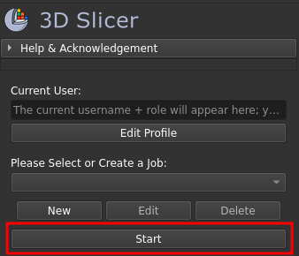
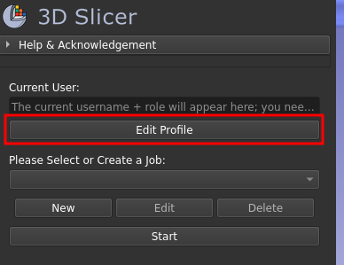
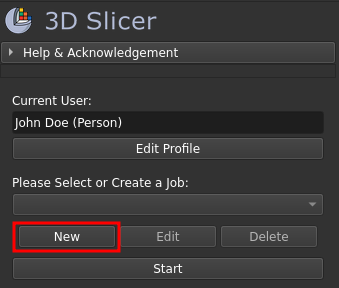
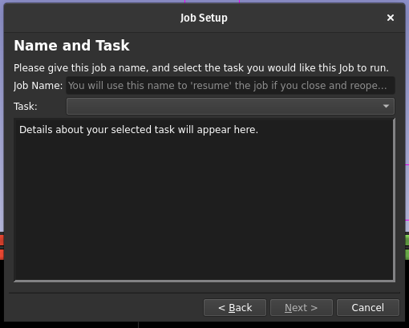
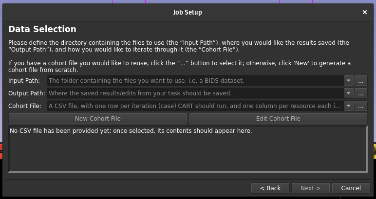
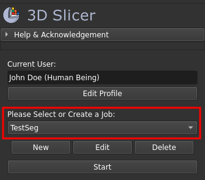
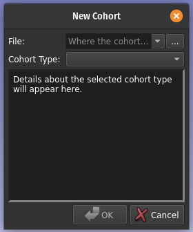
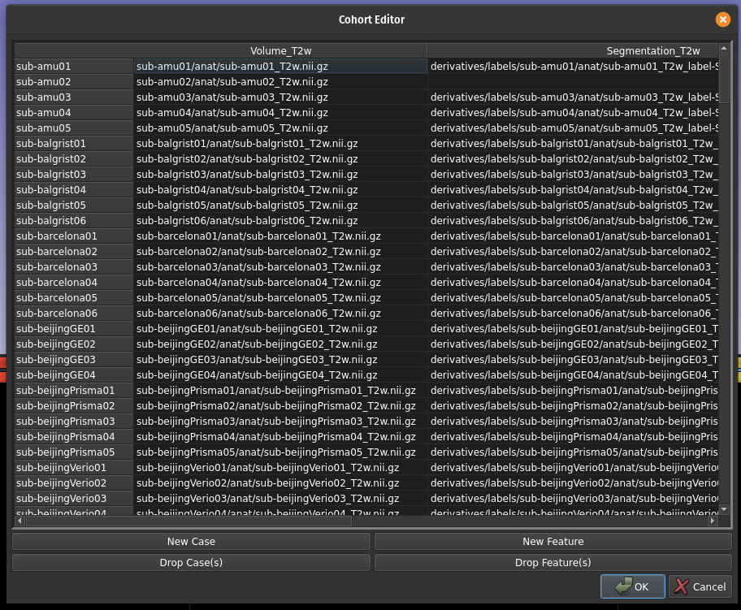

# Case Annotation and Review Tool (CART)

## Table of Contents

* [What is CART?](#what-is-cart)
* [For Users](#for-users)
  * [Setting up CART](#setting-up-cart)
  * [Getting Started](#getting-started)
  * [Starting a Task](#starting-a-task)
* [For Developers](#for-developers)
  * [Project Standards](#project-standards)
  * [IDE Set Up](#ide-set-up)
  * [Example Data](#example-data)

---

# What is CART?

CART is a module for 3D Slicer designed to help implement, manage, and run iterative analyses on image datasets. You can think of CART as an assembly line for data analysis; you define how your data should be grouped ("cases"), and what process you want to apply to it ("tasks"), and CART tracks how many you've completed and ensures that each has been processed by the task sequentially.

Currently, it provides the following capabilities:

* Managing sequential cases (be they patients, sub-studies, or other collections of data).
* Caching and memory management.
* Defining and handling multiple jobs, which can be run independently of one another.

A number of features are currently in progress as well:

* Custom task creation and registration.
* Case pre-fetching/deferred loading.

---

# For Users

## Installing CART

### Prerequisites

- Slicer v5.8 (other versions may work, without guarantee)

### Obtaining the Files

Clone this repository somewhere you can easily access it. You can do this one of two ways:

1. Downloading the repository from GitHub:
   1. Download the ZIP archive from [here](https://github.com/SomeoneInParticular/CART/archive/refs/heads/main.zip)
   2. Unpack the resulting ZIP archive to where you would like CART to live (on most OS systems, double-clicking on the file should tell you how to do this)

2. Cloning the repository via `git`:
   1. Open a terminal and navigate to the directory you'd like CART to live in.
   2. Run the following command to clone the current `CART` repository:
    ~~~
    git clone git@github.com:SomeoneInParticular/CART.git CART-main
    ~~~

### Registering CART in Slicer

0. Open a file browser window and navigate to the downloaded `CART-main` directory. Then, navigate to the `CART` subdirectory, which should contain a `CART.py` file.
1. Start up Slicer.
2. Select `Edit` (top left) > `Application Settings`

3. In the "settings" popup, select `Modules` from the left sidebar

4. Click and drag `CART.py` from the file browser into the "Additional module paths" panel.
5. Click "OK"; Slicer should prompt you that it needs to restart. Say "Yes".

### [Optional] Setting CART as your Default Module

1. Start Slicer
2. Select `Edit` (top left) > `Application Settings`
3. In the "settings" popup, select `Modules` from the left sidebar
4. Under "Default startup module", Select `Utilities` > `CART`

## Getting Started

CART has a built-in wizard to walk you through initial set up; once you've installed CART, just click "Start" and follow its instructions!

Alternatively, you can follow the subsections below one at a time; both will help you set up CART to run, this document just provides more details on the intent and purpose of each step of the process.

### Creating Your Profile

The user profile allows CART to track your name and (optionally) position. How CART uses this depends on the task, with many tasks using this to log who ran a given job or keep separate outputs on a per-user basis. CART requires you provide a name to function, however, and cannot run any jobs until you do so.

If you've just installed CART, you can click the "Edit Profile" button to fill in these credentials:

Fill in your name and (optionally) a position and confirm, and done! Your profile is now complete. You can edit it later by clicking the same button too, so no worries if you made a mistake or need to update it later.

### Job Creation

CART, much like a forman managing an assembly line, needs to have a method to tell the workers of the assembly line (3D Slicer) what they need to do. This includes what Slicer should expect to see (the "Cohort"), what it should do with it (the "Task"), and where to put results once they're done (the "Output"). Taken together, these form a "Job" for CART to reside over, and much like the forman, the boss (you) is the one that decides what the assembly line needs to be making.

To make this easier, CART provides a Job Setup wizard to walk you through this process; just click the "New" button to bring it up, and follow its instructions. Don't worry if you make a mistake as well; you can edit (or delete) CART job's after they've been generated.

#### Name and Task

Here you provide the job's name and decide what it should do (its "Task").

A job's name can be anything, so long as it isn't already used by another job registered in CART.

Selecting a task from the dropdown will bring up details on what it is designed to do and how it will do it; give it a skim to confirm it's what you'd like to do before proceeding.

In the future, you will be able to register and use custom tasks as well; this is still in development, however.

#### Data Selection

Here you define what files the job should use, where it should save its results, and how it should iterate through both. To select the former two, click the '...' to bring up the file browser to choose their respective folders.

Assuming you've never used CART before, you'll probably not have a cohort file ready. If so, click the "New Cohort File Button"; this will walk you through the process of creating one using the contents of the input folder you provided and the task you selected previously. See TODO for further details on what a cohort is and how to generate one. If you have a cohort file already, however, you can just select it via the same '...' button described prior.

#### Task-Specific Options

As the name implies, what appears here depends on the task you selected previously. This is usually configuration options which dictate how the task will run or save its results (i.e. the file format of its outputs), but the specifics are up to the task's developer. Skim through it to ensure they are configured to your liking, then continue.

#### Final Review

WORK IN PROGRESS!

## Running a Job

Once you've created your profile and created at least one job, select it from the dropdown highlighted below:

The "Start" button will now have CART start the job; enjoy!

## Cohorts and You

Within CART, a cohort dictates how CART's various tasks will iterate through the data specified within a job. Its stored as a `.csv` file, with each row indicates one "case" that will be run, with each column indicating a potential resource that each case could have; if it was generated using CART (see below), there will also be a `.json` sidecar file with it to provide additional metadata for CART's cohort utilities to use. 

Being a `.csv` file, you can create these from scratch, be it manually or via a script. However, CART provides the Cohort Generator and Cohort Editor to make doing so much more easy and intuitive, with both being accessible during Job creation and editing.

### The Cohort Generator

When you click the "New Cohort File" button during Job creation/editting, you'll be presented with the following:

Naturally, the `.csv` file needs to go somewhere; use the `...` button to bring up a file browser, allowing you to decide where this should be (you can also select an existing file if you want to replace it; this cannot be undone, however!)

You can then specify the cohort's "type", which how CART will identify and generate cases (rows). Select one to bring up details on how the given type will do so; you can also select "Blank Slate" if you want to create a cohort completely from scratch (with no cases identified by default _at all_). Once you click "Ok", a new cohort `.csv` (alongside a `.json` sidecar) will be created and opened in the Cohort Editor.

### The Cohort Editor

Once you have a cohort `.csv` file (generate by CART or otherwise), you can use the CART Cohort Editor to extend and/or modify it:

The buttons along the bottom allow you to add or drop cases (rows) and resources (columns). If you want to edit exiting rows/columns, right-click on the cells and select the corresponding "Modify" option instead. In both cases, CART will try to fill in the cells of the table intelligently based on the settings of rows/columns which intersect with the modified element. If you need to manually enter something into the table, double-clicking on the cell will let you edit the contents directly w/o using CART's automatic updating. How this automatic updating is run is task-specific; refer to the task's specific documentation for further details.

---

# For Developers:

## Project Standards

Below is a short summary of standards and format we use in CART; for more details, please refer to the [developer wiki](https://github.com/SomeoneInParticular/CART/wiki).

### Python

We follow [PEP8](https://peps.python.org/pep-0008/) standards with two notable exceptions:

* GUI code which directly utilizes or references C++ code (via QT) should use `lowerCamelCase` for functions, rather than the standard `lower_snake_case` used by Python, to help distinguish it from "pure" Python code.
* Line length is capped at 88 characters per line, rather than 79; this is derived from our linter (Black). You can read the justification [here](https://black.readthedocs.io/en/stable/the_black_code_style/current_style.html#line-length)

## IDE Set Up

### Source Directories

As both Slicer and CART load libraries into Python's path post-init, most IDEs will not be able to recognize some of the import statements used by our codebase by default.

To fix this, please mark the following directories as "source" folders in the Project's structure:

* `{Slicer Installation Directory}/bin/Python`: exposes that installations versions of VTK, CTK, and QT, along with slicer's own utilities.
* `{This Directory}/CART`; exposes CARTLib and its contents.

## Example Data

The example data consists of a subset (fold0) from the PI-CAI dataset, featuring prostate MRI images and their corresponding segmentations. The original data can be obtained from the [official website](https://zenodo.org/records/6624726) by downloading the `picai_public_images_fold0.zip` file.

For this project, the first four subjects were selected and the images were converted from MHA to NRRD format.

1. Example `sample_data` is adapted from this original data and is located under `sample_data.zip`.
2. Unzip the file to a folder of your choice.
